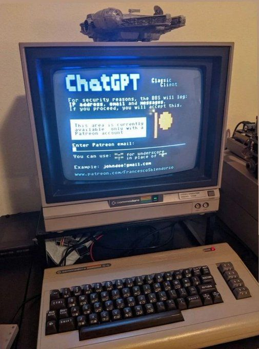
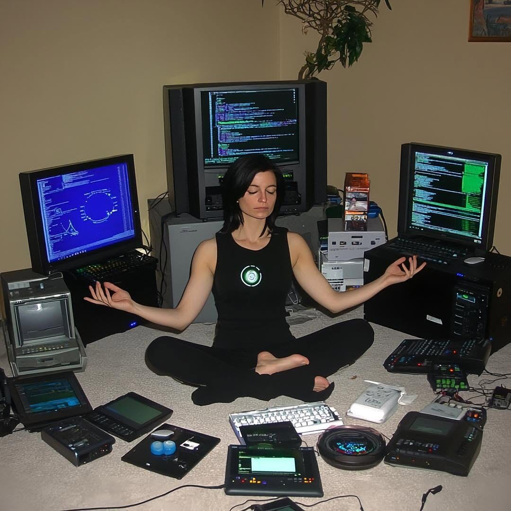

  

   
  
  

   

  
  
  
  
  

  

    <i>I am a 2nd-year BCA student at <b>VIPS College, GGSIPU</b>, building backend-focused projects while learning production engineering fundamentals.   Open to <b>backend internships</b>, <b>full-stack internships</b>, and learning-focused engineering opportunities.</i>
  

## 👨‍💻 About Me

  

> [!NOTE]  
> I like working close to the backend layer: designing REST APIs, modeling data, handling authentication and permissions, adding caching, and thinking through how systems behave beyond the happy path.

Right now, I am focused on becoming a stronger backend engineer with practical understanding of:

- 🏗️ **Architecture**: API design, Multi-tenant application design, Backend project structure
- 🔐 **Security**: Authentication, Authorization, and RBAC
- 🗄️ **Data**: PostgreSQL-backed data modeling, Redis caching, Rate limiting
- 🚀 **DevOps**: Docker, Nginx, VPS deployment, and CI/CD fundamentals

## 🛠️ Tech Stack

   
  
   
   

## 🚀 Featured Project

### [Projects Hub](https://github.com/Sumitdixit2/projects-hub)

> [!TIP]
> Backend-focused agency and project management platform built around multi-tenant architecture and role-based access control.

  <table style="border-collapse: collapse; width: 100%; border: none;">
    <tr style="border: none;">
      <td width="55%" style="border: none; vertical-align: top; text-align: left;">
        <h4>Problem It Solves</h4>
        
Helps agencies manage clients, projects, milestones, permissions, assignments, and activity tracking in one place.

        <h4>Backend Concepts Used</h4>
        <ul>
          <li><b>Multi-tenant architecture</b> & Role-based access control</li>
          <li>CRUD APIs for clients, projects, and milestones</li>
          <li><b>Rate Limiting</b>: IP-based fixed-window & User-based token bucket</li>
          <li><b>Caching</b>: Redis caching and structured backend patterns</li>
        </ul>
        
<b>Stack:</b> Next.js, Express.js, PostgreSQL, Redis, Nginx

      </td>
      <td width="45%" style="border: none; vertical-align: middle; text-align: center;">
        
      </td>
    </tr>
  </table>

## 🌱 Current Focus

  

> [!IMPORTANT]
> My primary learning goals right now are centered around scaling and delivering production-ready applications.

  <table style="border-collapse: collapse; width: 100%; border: none;">
    <tr style="border: none;">
      <td width="50%" style="border: none; text-align: left;">
        <ul>
          <li>🔄 CI/CD pipelines with GitHub Actions</li>
          <li>🐧 VPS deployment & production server basics</li>
          <li>💳 Payment system implementation</li>
        </ul>
      </td>
      <td width="50%" style="border: none; text-align: left;">
        <ul>
          <li>📈 Backend scalability patterns</li>
          <li>🧠 System design fundamentals & DSA</li>
          <li>🤝 Open-source contribution habits</li>
        </ul>
      </td>
    </tr>
  </table>

